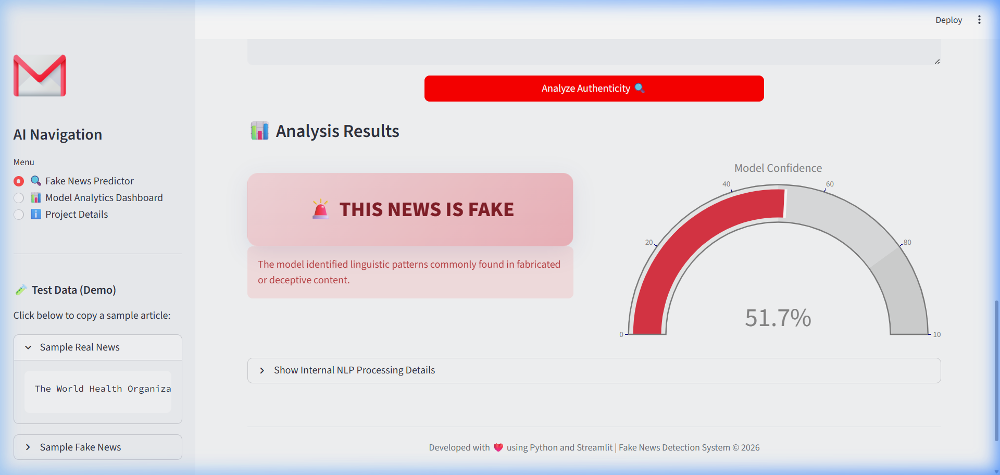
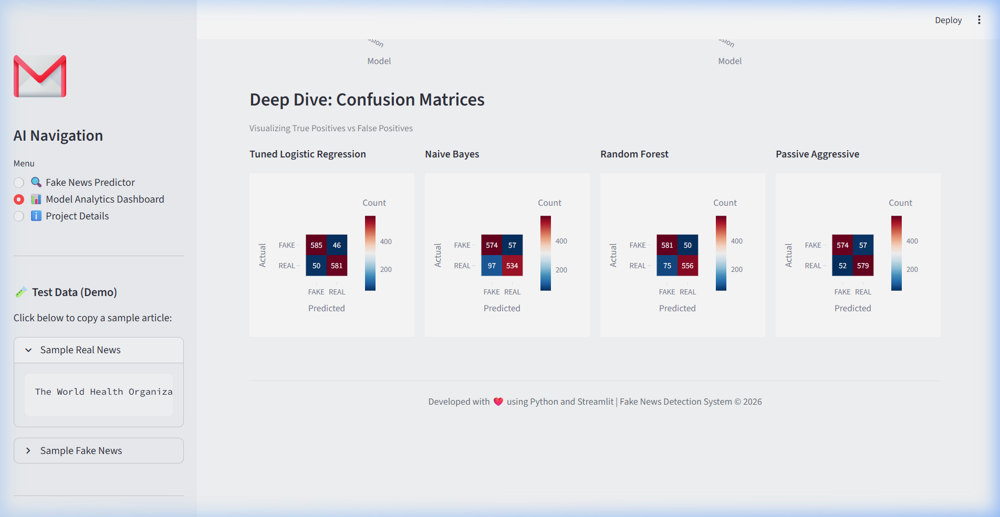

# Fake News Detection System 📰


A professional, end-to-end Machine Learning project that classifies news articles as **REAL** or **FAKE** using Natural Language Processing (NLP) and a modern Streamlit dashboard.

## 🚀 Project Overview

The **Fake News Detection System** takes any text input (e.g., news articles or headlines) and predicts whether the content is likely real or fake. It utilizes state-of-the-art NLP techniques to preprocess the text and hyperparameter-tuned machine learning models to classify it. 

The project includes an elegant UI built with Streamlit and Plotly, offering interactive charts, confidence score gauges, and a full training pipeline that evaluates multiple machine learning models to automatically select the best performer.

## 🌟 Features

- **Text Preprocessing Pipeline:** Implements lowercasing, punctuation removal, stopword removal, tokenization, and lemmatization using `NLTK`.
- **Automated Dataset Download:** Includes a script to automatically download a public Kaggle-equivalent fake news dataset with over 6,000 articles.
- **Multiple ML Models & Hyperparameter Tuning:** Trains `Logistic Regression`, `Naive Bayes`, `Random Forest`, and `Passive Aggressive Classifier`. Uses `GridSearchCV` to automatically find the best parameters.
- **Modern UI Dashboard:** A clean, responsive, dark-mode friendly Streamlit interface with Plotly charts.
- **Visual Analytics:** Interactive gauge charts for confidence scores and bar/heatmap charts for Model Accuracy, Precision, Recall, and Confusion Matrices.

## 🛠️ Technologies Used

- **Programming Language:** Python 3
- **Data Manipulation:** Pandas, NumPy
- **Machine Learning:** Scikit-Learn
- **Natural Language Processing:** NLTK
- **Frontend / UI:** Streamlit, Plotly
- **Model Serialization:** Joblib
- **Deployment Tools:** Gunicorn, Requests

## 📂 Folder Structure

```
FakeNewsDetection/
│
├── app/
│   ├── app.py               # Streamlit frontend dashboard
│   ├── prediction.py        # Logic to load model and make predictions
│   └── preprocessing.py     # NLP text cleaning functions
│
├── dataset/
│   └── fake_or_real_news.csv# Downloaded dataset (6,335 articles)
│
├── models/
│   ├── best_model.pkl       # The highest performing trained model
│   ├── tfidf_vectorizer.pkl # Fitted TF-IDF Vectorizer
│   └── metrics.json         # Performance metrics of all evaluated models
│
├── training/
│   └── train_model.py       # Script to train models, evaluate, and save best
│
├── screenshots/             # UI screenshots
│
├── download_dataset.py      # Script to fetch the real-world dataset
├── requirements.txt         # Required Python dependencies
├── README.md                # Project documentation
└── .gitignore               # Ignored files and folders
```

## ⚙️ Local Installation & Setup

1. **Clone or Download the Repository**
2. **Navigate to the Project Directory**
   ```bash
   cd FakeNewsDetection
   ```
3. **Install Dependencies**
   ```bash
   pip install -r requirements.txt
   ```
4. **Download the Dataset**
   ```bash
   python download_dataset.py
   ```
5. **Train the Models**
   ```bash
   python training/train_model.py
   ```
6. **Run the Streamlit Application**
   ```bash
   streamlit run app/app.py
   ```

## ☁️ Deployment Guide

This project is structured to be easily deployable on major cloud platforms.

### 1. GitHub Preparation
Ensure all files are committed except those listed in `.gitignore` (such as the `models/` `.pkl` files and `dataset/` `.csv` files). Note: For Streamlit Cloud, you might actually want to commit the `models/` directory so the app works immediately upon deployment without retraining. You can remove `models/*.pkl` from `.gitignore` if deploying to Streamlit Cloud.

### 2. Streamlit Cloud Deployment
1. Push your repository to GitHub.
2. Go to [share.streamlit.io](https://share.streamlit.io/) and connect your GitHub account.
3. Click **New App** and select your repository.
4. Set the **Main file path** to `app/app.py`.
5. Click **Deploy**. Streamlit Cloud will automatically install packages from `requirements.txt`.

### 3. Render Deployment
1. Push your repository to GitHub.
2. Go to [Render](https://render.com/) and create a new **Web Service**.
3. Connect your GitHub repository.
4. Set the **Start Command** to:
   ```bash
   streamlit run app/app.py --server.port $PORT
   ```
5. Render will detect the `requirements.txt` and install everything via `gunicorn` and `streamlit`.

## 📸 Screenshots


*(Screenshot of the Predictor Tab)*


*(Screenshot of the Model Performance Dashboard)*

## 🔮 Future Enhancements

- Integrate Deep Learning models (LSTM, BERT) for contextually rich predictions.
- Add Web Scraping to analyze news directly from a provided URL.
- Implement User Authentication for a personalized experience.
